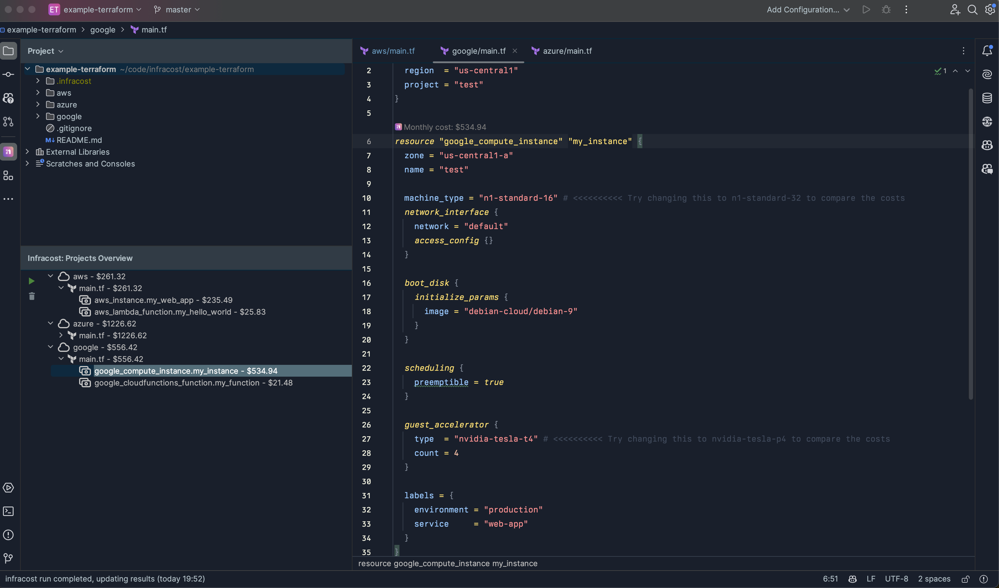
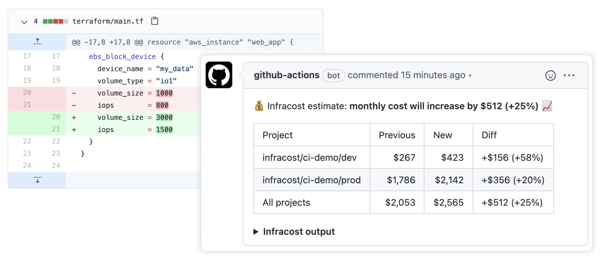

# Infracost JetBrains Plugin

[](https://plugins.jetbrains.com/plugin/24761-infracost)
[](https://plugins.jetbrains.com/plugin/24761-infracost)
[](https://plugins.jetbrains.com/plugin/24761-infracost)




## Demo Video

[](https://www.youtube.com/watch?v=kgfkdmUNzEo)

## Description

<!-- Plugin description -->
Infracost is an IntelliJ-based plugin that allows you to shift left on your Cloud costs by providing cost estimates for
your Terraform code.

Infracost is a companion to the [Infracost CLI](https://www.infracost.io/docs/integrations/cicd) and provides a way to
view cost estimates directly in your IDE.
<!-- Plugin description end -->

## Features

- View cost estimates for your Terraform code directly in your IDE
- Supports all JetBrains IDEs
- Supports all Terraform providers

## Installation

You can install the plugin from the JetBrains Plugin Repository.

1. Open the IDE and go to `Settings` -> `Plugins` -> `Marketplace`
2. Search for `Infracost`
3. Click `Install`
4. Restart the IDE
5. Open a Terraform file and click on the `Infracost` tab at the bottom of the IDE
6. Click on `Refresh` to get the cost estimate
7. Use our [CI/CD integrations](https://www.infracost.io/docs/integrations/cicd/) to add cost estimates to pull
   requests. This provides your team with a safety net as people can understand cloud costs upfront, and discuss them as
   part of your workflow.
   


## FAQs

### How can I supply input variables to Infracost Intellij extension?

To supply input variables for your Terraform projects, we recommend you add a [config file](https://www.infracost.io/docs/features/config_file/). Config files allow you to add any number of variable files for defined projects. Infracost also auto-detects any var files called `terraform.tfvars`, or `*.auto.tfvars` at the root level of your Terraform projects. e.g:

```yaml
version: 0.1
projects:
  - path: dev
    name: development
    usage_file: dev/infracost-usage.yml
    terraform_var_files:
      - dev.tfvars
      - global.tfvars
```

Both HCL and JSON var files are supported, JSON var files must include a `.json` suffix.

### How do I supply a usage file to the Infracost Intellij extension?

To supply input variables for your Terraform projects, we recommend you add a [config file](https://www.infracost.io/docs/features/config_file/). Config files allow you to define a usage file for each project you specify, e.g:

```yaml
version: 0.1
projects:
  - path: dev
    usage_file: dev/infracost-usage.yml
  - path: prod
    usage_file: prod/infracost-usage.yml
```

### I see a lot of resources showing $0.00 costs, why is this?

These resources are likely usage-based resources. For example, AWS Lambda is billed per request, so unless you specify the number of requests that the function receives. You're likely to see a message similar to the following: " Cost depends on usage: $0.20 per 1M requests" in the resource breakdown.

To specify usage for resources, add a [usage file](https://www.infracost.io/docs/features/usage_based_resources/#specify-usage-manually) and reference it in a [config file](https://www.infracost.io/docs/features/config_file/) you add at the root of your workspace.

### How can I configure the currency Infracost uses?

If you have the `infracost` CLI installed, you can set the currency by running `infracost configure set currency EUR` (check `infracost configure --help` for other configuration options). Otherwise, update the global infracost configuration file (found at `~/.config/infracost/configuration.yml`) with the following:

```yaml
version: "0.1"
currency: EUR
```

Infracost supports all ISO 4217 currency codes. [This FAQ](https://www.infracost.io/docs/faq/#can-i-show-costs-in-a-different-currency) has more details.
