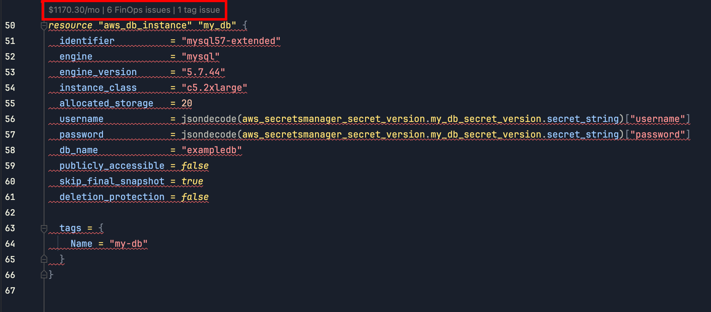
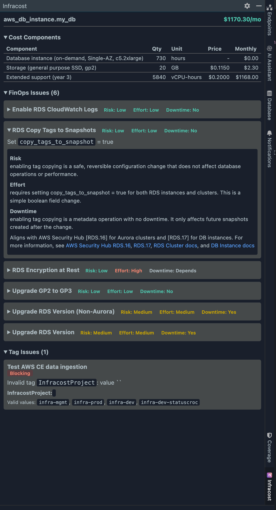
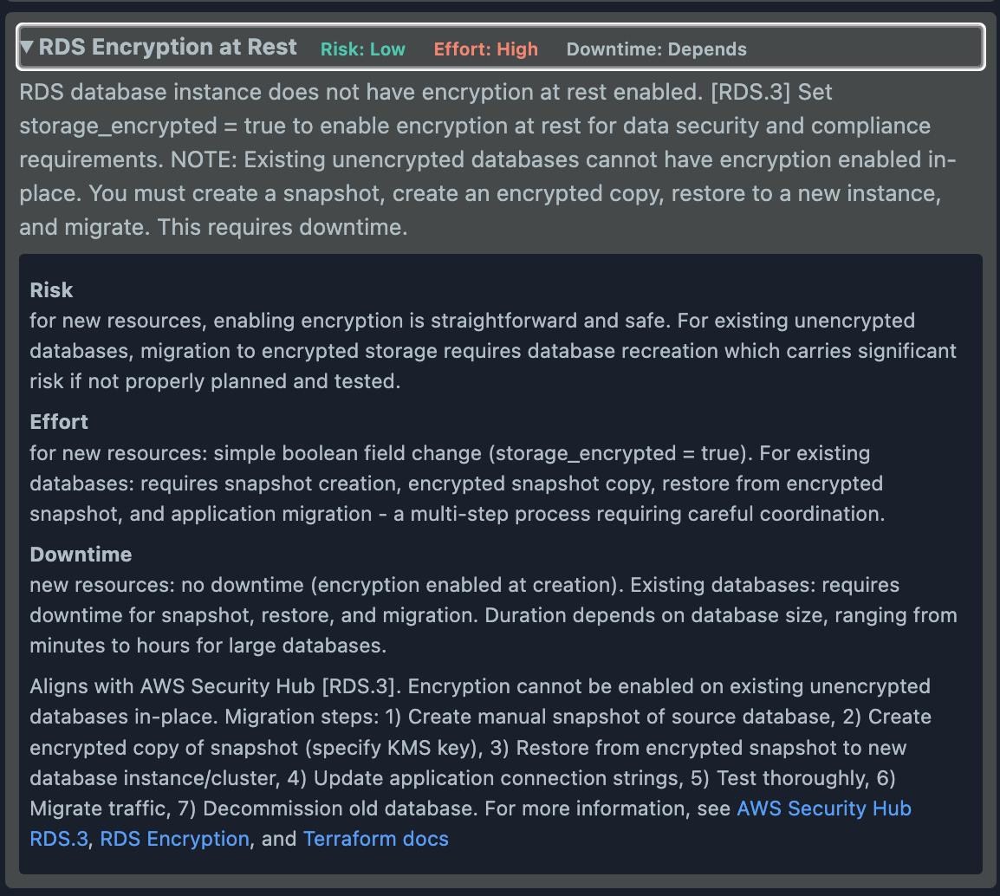
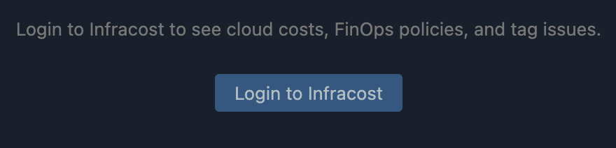

# Infracost JetBrains Plugin

Infracost's JetBrains plugin shows you cost estimates for Terraform right in your editor! It also surfaces FinOps policies and tagging issues so you can catch problems before they reach production.

## Features

### Inline cost estimates

See cost estimates as code vision hints directly above Terraform resource definitions. Costs update as you edit.

### Resource details sidebar

Click a code vision hint to open the resource details panel, showing a full cost component breakdown, FinOps policy violations, and tagging issues.

### FinOps policies and tag issues

The plugin highlights FinOps policy violations (with risk, effort, and potential savings) and tag policy issues directly in the sidebar. Blocking violations are clearly marked.

### CloudFormation support

In addition to Terraform (`.tf`) files, the plugin supports CloudFormation templates in YAML and JSON.

## Get started

### 1. Install the plugin

Open the IDE and go to `Settings` -> `Plugins` -> `Marketplace`, search for `Infracost`, and click `Install`. Restart the IDE.

### 2. Login to Infracost

Open the Infracost tool window and click **Login to Infracost**. This will open a browser window to authenticate your editor with your Infracost account.

### 3. Open a Terraform project

Open a project containing Terraform files. The plugin will start the language server and begin scanning your project. Cost estimates will appear as code vision hints above resource blocks.

### 4. Cost estimates in pull requests

[Use our CI/CD integrations](https://www.infracost.io/docs/integrations/cicd/) to add cost estimates to pull requests, giving your team visibility into cloud costs as part of your workflow.

## Requirements

* A JetBrains IDE (IntelliJ IDEA, GoLand, PyCharm, WebStorm, etc.)
* An [Infracost](https://www.infracost.io) account

## Settings

Go to `Settings` -> `Tools` -> `Infracost` to configure:

- **Server path** — path to the `infracost-ls` binary. Leave empty to use the bundled binary or find it on your PATH.
- **Cache TTL** — how long (in seconds) to cache run parameters between API calls. Defaults to 300.

## How it works

This plugin is a lightweight LSP client that connects to the `infracost-ls` language server. The server handles all Terraform/CloudFormation parsing, cost estimation, and caching. The plugin surfaces cost data via JetBrains Code Vision and a detail panel in the tool window.

